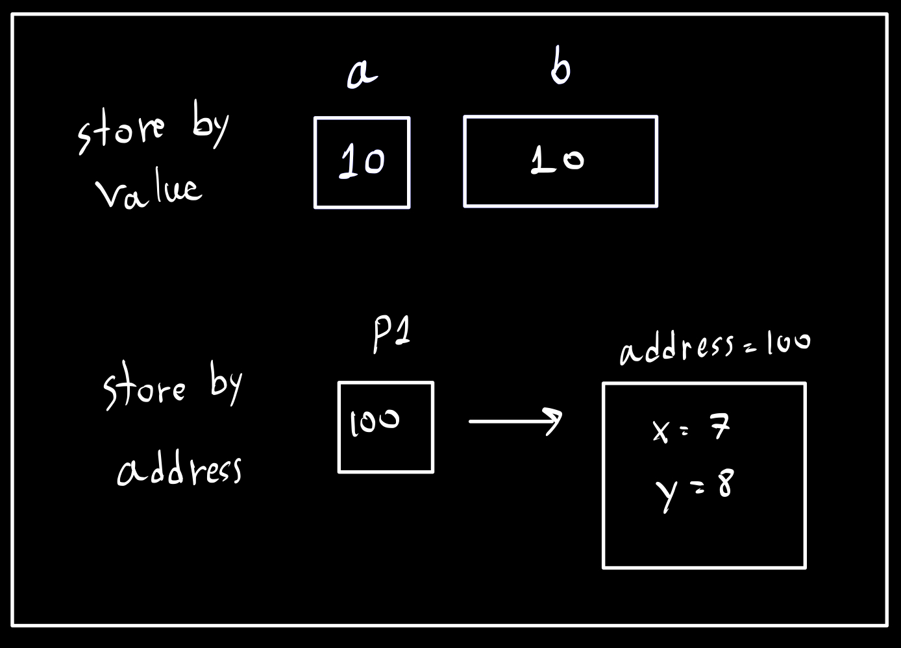

### Change Hot Key

    Ecilpse setting --> General --> Key --> content Assist

---

### Class in java name start with UpperCase and camelCase

---

## Data Types

> There are 2 types of data types:

### 1. Primitive Data Types (8)

> Known size, stored by value.

#### 1.1 Integer Types

- **byte**: 8-bit
- **short**: 16-bit
- **int**: 32-bit (default)
- **long**: 64-bit

```java
long l  = (long) 7; // Casting
long l2 = 7L;       // Add literal
```

#### 1.2 Floating-Point Types

- **float**: 32-bit

```java
float f  = (float) 7.5; // Casting
float f2 = 7.5f;        // Add literal
```

- **double**: 64-bit (default)

#### 1.3 Character Type

- **char**: 16-bit

#### 1.4 Logical Type

- **boolean**: 1-bit

---

## Casting

### Example in Java:

```java
int a = 10; // int is 4 bytes
long b = a; // long is 8 bytes
int c = (int) b; // Casting
```

### Explanation:

- **Auto Casting:** `4 bytes` can fit into `8 bytes` automatically (no explicit cast needed).
- **Explicit Casting:** `8 bytes` cannot fit into `4 bytes` directly and requires explicit casting.
  - This may result in **data loss**.

### What Does Casting Do?

Casting **trims the excess bytes** to fit the target type.

#### Example:

```java
long b = 12345678; // Original value
int c = (int) b;   // Result: 5678
```

- Only the lower 4 bytes (last digits) of the original value are retained when casting from `long` to `int`.

Here's an improved and better-formatted version of your Markdown:

### 2. Class Data Types (Non-Primitive)

> Reference types store references to objects in memory.

---

#### Code Example: Primitive vs. Non-Primitive Data Types

```java
import java.awt.Point;

// Primitive types
int a = 10;
long b = 7;

// Non-primitive type
Point p1 = new Point(7, 8); // Starts with UpperCase and uses "new" to allocate memory
System.out.println(p1); // Output: java.awt.Point[x=7,y=8]
```

> **Note**: The `new` keyword is used to allocate memory for the object.
> **Note**: String is object but not need new

#### Diagram: Store by Value vs. Store by Address



---

#### Code Example: Reference Behavior in Non-Primitive Data Types

```java
Point p2 = p1;
p2.x = 100;

System.out.println(p2); // Output: java.awt.Point[x=100,y=8]
System.out.println(p1); // Output: java.awt.Point[x=100,y=8]
```

> Changing `x` in `p2` also affects `x` in `p1` because `Point p2 = p1` means both `p1` and `p2` point to the same memory address.

#### Explanation:

When you assign `p2 = p1`, both `p1` and `p2` reference the same object in memory. Any changes made to the object through `p2` are also reflected in `p1` because they share the same memory address.

#### Updated Diagram:


---

## Scanner

The `Scanner` class is used to take input from the keyboard in Java. Here's how to use it:

---

### Code Example: Using Scanner to Read Input

```java
import java.util.Scanner;

public class MyProgram {
    public static void main(String[] args) {
        Scanner scanner = new Scanner(System.in); // System.in --> input from keyboard

        // Reading a line of text
        System.out.println("Enter your name:");
        String name = scanner.nextLine(); // Reads the entire line

        // Reading a word
        System.out.println("Enter a single word:");
        // String name = scanner.next(); // Uncomment to read a single word instead

        // Reading an integer
        System.out.println("Enter your age:");
        int age = scanner.nextInt(); // Reads an integer

        // Reading a double
        System.out.println("Enter your GPAX:");
        double gpax = scanner.nextDouble(); // Reads a double

        // Closing the scanner
        scanner.close(); // Always close the scanner to free resources

        // Output the input
        System.out.println("Name: " + name);
        System.out.println("Age: " + age);
        System.out.println("GPAX: " + gpax);
    }
}
```

---

### Key Points to Remember:

1. **`Scanner scanner = new Scanner(System.in);`**
   - `System.in` specifies that input is from the keyboard.
   - `File.in` read form file
2. **Methods in `Scanner`:**

   - `nextLine()` - Reads an entire line of text.
   - `next()` - Reads a single word.
   - `nextInt()` - Reads an integer.
   - `nextDouble()` - Reads a double.
   - ect.

3. **Always Close the Scanner:**
   - Use `scanner.close()` at the end of the program to release resources.

---

### Sample Output

#### Input:

```
Enter your name:
John Doe
Enter your age:
25
Enter your GPAX:
3.75
```

#### Output:

```
Name: John Doe
Age: 25
GPAX: 3.75
```

---

## Convert

```java
int age = 18;
double ageDouble = age * 1.0; // int --> double
int ageIngt = ageDouble; // double --> int
Stirng ageString = age + ""; // number --> string
Stirng ageString = age + "1"; // ageString = 181


double age2 = Double.parseDouble(agestring) + 7.5; // string --> double
int age3 = Integer.parseInt(ageString) + 5 // string -> int
```

---

## Java Program Workflow

### 1. General Workflow for Other Languages

- **Source Code** → (1) Compile → (2) Run
  - Output: `file.o` for different platforms:
    - macOS: `file.o`
    - Windows: `file.o`
    - Linux: `file.o`

---

### 2. Workflow for Java Programs

- **Source Code (`file.java`)** → (1) `javac` → `file.class` → (2) `java` → Run
  - Output: `file.class` (Bytecode; Platform-independent Java bytecode)

---

### 3. Key Notes

- **`javac`** = Java Compiler
- **`java`** = Java Virtual Machine (JVM) execution command
- Java's motto: **"Write Once, Run Anywhere"**
  - Bytecode (`file.class`) can run on macOS, Windows, and Linux, provided they have JRE installed.

---

### 4. JDK vs. JRE

#### What is JDK?

- **JDK**: Java Development Kit
  - Includes both:
    - `javac` (compiler)
    - `java` (runtime)

#### What is JRE?

- **JRE**: Java Runtime Environment
  - Includes only:
    - `java` (runtime environment for executing bytecode)

---

### 5. Key Requirement

- To run `file.class` on macOS, Windows, or Linux:
  - Each platform must have **JRE (Java Runtime Environment)** installed.

## Loop

Here’s the content split into two sections for **Loops** and **ArrayList**, with improved formatting:

---

## Loops in Java

### Using Arrays with Loops

#### Example: `for` Loop and `for-each` Loop

```java
int[] tests = new int[3];
tests[0] = 7;
tests[1] = 9;
tests[2] = 10;

// Using for loop
for (int i = 0; i < tests.length; i++) {
    System.out.println(tests[i]);
}

// Using for-each loop
for (int t : tests) {
    System.out.println(t);
}
```

---

### Key Notes on Loops

1. **`for` Loop**:

   - Iterates using an index variable.
   - Ideal when you need the index for additional operations.

2. **`for-each` Loop**:
   - Simplifies iteration over arrays or collections.
   - Does not give access to the index directly.

---

## ArrayList in Java

### Working with `ArrayList`

#### Example: Basic Operations with `ArrayList`

```java
import java.util.ArrayList;
import java.lang.System; // auto-import

// Create an ArrayList and initialize with a size of 3
ArrayList<Integer> scores = new ArrayList<Integer>(3);

// Add elements to the ArrayList
scores.add(7);
scores.add(9);
scores.add(10);
scores.add(11);
scores.add(20);

// Print the size of the ArrayList
System.out.println(scores.size()); // Output: 5

// Print all elements in the ArrayList
System.out.println(scores); // Output: [7, 9, 10, 11, 20]

// Access and print a specific element (index 3)
System.out.println(scores.get(3)); // Output: 11
```

---

### Key Notes on `ArrayList`

1. **Dynamic Size**:

   - `ArrayList` grows or shrinks dynamically, unlike arrays with a fixed size.

2. **Useful Methods**:

   - `add(element)`: Adds an element to the `ArrayList`.
   - `get(index)`: Retrieves an element at the given index.
   - `size()`: Returns the number of elements in the `ArrayList`.

3. **Initialization**:

   - When creating an `ArrayList` with an initial capacity, it’s just a hint. The list grows as needed.

4. **Auto-import**:
   - `System` is auto-imported, but classes like `ArrayList` must be explicitly imported.

---

## Methods in Java

---

### Method Syntax and Examples

#### 1. Void Method (No Return Value)

**Format:**

```java
public static void <methodName>(<typeVariable> <nameVariable>) {
    // code
}
```

**Example:**

```java
public static void hello(String name) {
    System.out.println("Hello " + name);
}
```

---

#### 2. Method with a Return Value

**Format:**

```java
public static <returnType> <methodName>(<typeVariable> <nameVariable>) {
    // code
    return // same type as <returnType>
}
```

**Example:**

```java
public static int add(int a, int b) {
    return a + b;
}
```

---

### Pass by Value vs. Pass by Reference

#### 1. Pass by Value

- In Java, **primitive types** (e.g., `int`, `double`, etc.) are passed by value.
- This means that a copy of the variable is passed to the method, and changes to the parameter inside the method do not affect the original variable.

**Example:**

```java
public static void main(String[] args) {
    int x = 5;
    int y = func1(x);
    System.out.println(x + " " + y);
}

public static int func1(int a) {
    a += 10;
    return a * 2;
    /*
    In the main method:
    Output = 5 30
    */
}
```

---

#### 2. Pass by Reference

- For **objects** (e.g., arrays, classes), Java passes the reference to the object.
- Changes made to the object inside the method affect the original object.

**Example:**

```java
public static void main(String[] args) {
    int[] x = new int[3];
    int y = func2(x);
    System.out.println(x[0] + " " + y);
}

public static int func2(int[] a) {
    a[0] += 10;
    return a[0] * 2;
    /*
    In the main method:
    Output = 15 30
    */
}
```

---

### Key Notes

1. **Void Methods:**

   - Use when you don’t need to return a value.
   - Example: Displaying text with `System.out.println()`.

2. **Methods with Return Values:**

   - Use when the method must return a specific result.
   - Example: Calculating the sum of two integers.

3. **Pass by Value:**

   - Changes inside the method do not affect the original variable.
   - Applies to primitive types.

4. **Pass by Reference:**
   - Changes inside the method affect the original object.
   - Applies to objects like arrays and custom classes.

---

```

```
