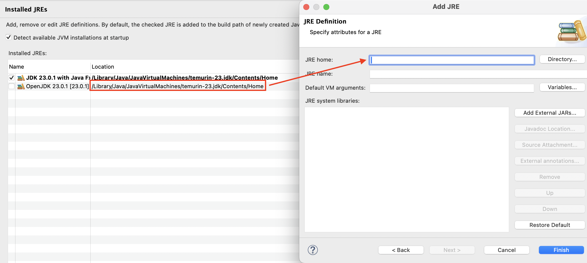

# Resources for Preparation

## 📄 Slides

- [**Graphical User Interface (GUI) 2024**](<./Graphical_User_Interface_(GUI)_2024_2-1291-17362625561853.pdf>)

## 📺 YouTube Lectures

### 🎥 Lecture 5: JavaFX Lecture

- [**JavaFX1 Installation**](https://www.youtube.com/watch?v=3SM6pwrvZGk)

  **Permanent setup for JavaFX (Mac Users)**:

  1. Check your installed JDK location.
      <br><br>
  2. Click "Add" and select **MacOS X VM**.
     <br><br>
  3. Set up your JDK path from Step 1, name it, configure default VM arguments, and add external JARs.
      <br><br>
  4. Finish the setup.
     <br><br>

- [**JavaFX2 Example**](https://www.youtube.com/watch?v=JEBze6Wi-xs)
- [**JavaFX3 Scene Builder & Event Handling**](https://www.youtube.com/watch?v=5zWU5y_TNHE)
- [**JavaFX4 Creating a JAR File**](https://www.youtube.com/watch?v=ZE62QWGBKOQ)

---

### MyFXHelloWorld

```java
import javafx.application.Application;
import javafx.scene.Scene;
import javafx.scene.layout.StackPane;
import javafx.stage.Stage;

public class TestMyMainWindow extends Application {

	@Override
	public void start(Stage primaryStage) {

		StackPane root = new StackPane(); // Creat StackPane

		Scene scene = new Scene(root, 300, 250); // Creat scene wide 300 high 250

		primaryStage.setTitle("MyJavaFX");  // Set the stage title
		primaryStage.setScene(scene);       // Place the scene
		primaryStage.show();
	}

	public static void main(String[] args) {
		launch(args);
	}
}
```


```java

package playGround;s

import javafx.application.Application;
import javafx.stage.Stage;
import javafx.scene.Scene;
import javafx.scene.layout.StackPane;

import javafx.scene.control.Button; // add this line

public class TestMyMainWindow extends Application {

	@Override
	public void start(Stage primaryStage) {

		StackPane root = new StackPane();

		Button button = new Button("Hello World !"); // Creat Button text = "Hello World !"
		root.getChildren().add(button); // add button in scene

		Scene scene = new Scene(root, 300, 250);

		primaryStage.setTitle("MyJavaFX");
		primaryStage.setScene(scene);
		primaryStage.show();
	}

	public static void main(String[] args) {
		launch(args);
	}
}
```

## 

### MyMainWindow

```java
public class MyMainWindow extends Application {

    @Override
    public void start(Stage primaryStage) {

    	FlowPane root = new FlowPane();

        Button exitButton = new Button(" Exit "); // Creat button text = Exit

        root.getChildren().add(exitButton); // add button to scene

        Scene scene = new Scene(root, 410, 200); // Creat scene wide = 410 high = 200

        primaryStage.setTitle("Main Window");
        primaryStage.setScene(scene);
        primaryStage.show();
    }
    public static void main(String[] args) {
        launch(args);
    }
```


```java
public class temp extends Application {

	@Override
        TextField text = new TextField("This is a text field.");    // add Text field
        root.getChildren().add(text);                               // add text to scene

```


```java
public class temp extends Application {

	@Override
	public void start(Stage primaryStage) {
		Button showButton = new Button(" Show ");   // Create button show
		root.getChildren().add(showButton);         // add showButton to scene

```


```java
@Override
	public void start(Stage primaryStage) {

		FlowPane root = new FlowPane();
		root.setPadding(new Insets(5)); // set gap between Padding
    	        root.setHgap(5); // set gap between button or TextField in horizontal
    	        root.setVgap(5); // set gap between button or TextField in vantical

```


```java
	@Override
	public void start(Stage primaryStage) {

		FlowPane root = new FlowPane();
		root.setPadding(new Insets(5));
		root.setHgap(5);
		root.setVgap(5);

		Button exitButton = new Button(" Exit ");
		exitButton.setPrefWidth(70); // set button wide

		TextField text = new TextField("This is a text field.");
		text.setPrefWidth(250); // set TextField

		Button showButton = new Button(" Show ");
		showButton.setPrefWidth(70); // set button wide

		root.getChildren().addAll(showButton, text, exitButton); // add all element

		Scene scene = new Scene(root, 410, 200);

		primaryStage.setTitle("Main Window");
		primaryStage.setScene(scene);
		primaryStage.show();
	}

	public static void main(String[] args) {
		launch(args);
	}

}

```


## Scene Builder

### ⚠️ If can not new fxml document fix by this step

- Go to **Help** > **Install New Software**
- Click the **Add**... button beside **Manage**....
- A dialog titled **Add Repository** will appear, asking for a name and location.
  - For the name field, you can insert something like `e(fx)clipse nightly`.
  - For the location field, insert `https://download.eclipse.org/efxclipse/updates-nightly/site/` <br><br>
    /fix_e(fx)_1.png>) <br><br>
  - Click `Add`.<br><br>
    /fix_e(fx)_2.png>)

### In Scene Builder

- in **`fx:id` you must fill !**
- `On Action` to link method
- Adding the attrubute **`fx:controller`**

  - ex `fx:controller = "application.MyController"`
  - in class MyController `implements Initializable`<br><br>

  ```java
  @FXML
  private Button myButton; // same fx:id

  @FXML
  private TextField outputField; // same fx:id

  ```

- to Run "MyApplication" **Must include these three things.**
  - SceneBuilder.fxml
  - Controller.java
  - Application.java

### CSS

- #### Syntax:
  ```java
  ATTRUBUTE_NAME.setStyle("CSS_1";"CSS_2")
  ```
#### Not use CSS <br>


#### set grid style <br>

```java
grid.setStyle("-fx-background-color:lightgray;");
```


#### set scenetitle style <br>

```java
scenetitle.setStyle(
    "-fx-font-size: 32px;
    -fx-font-family:\"Arial Black\";
    -fx-fill: #555;"
);
```


#### set signinBtn style <br>

```java
signinBtn.setStyle(
	"-fx-text-fill: white;
    -fx-font-weight: bold;
    -fx-font-family: \"Arial Narrow\";
    -fx-background-color: darkgreen;"
);
```


#### set exitButton style <br>

```java
exitBtn.setStyle(
    "-fx-text-fill: white;
    -fx-font-weight: bold;
    -fx-font-family: \"Arial Narrow\";
    -fx-background-color: darkred;"
);
```


## Binding properties

- ### Syntax:

```java
ATTRUBUTE_NAME.PROPERTY().BINDING_TYOE(ATTRUBUTE_TARGET.PROPERTY());
```
- ### bind

```java
// Unidirectional bindings
userNameOut.textProperty().bind(userTextField.textProperty());
```

https://github.com/user-attachments/assets/0672a2e8-eead-4beb-a914-c146f3ab70a6
- ### bindBindingrectional

```java
// Bidirectional bindings
pwBox1.textProperty().bindBidirectional(pwBox2.textProperty());
```

https://github.com/user-attachments/assets/d310ea59-cd80-4850-bc60-7a0bd40d29b3

